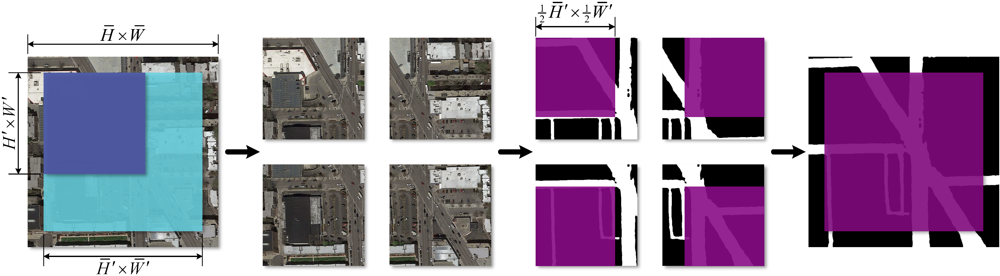

# CS-433 Machine Learning - Class Project 2


## Group Members：

- Aoyu Gong (aoyu.gong@epfl.ch)
- Sijia Du (sijia.du@epfl.ch)
- Yuxuan Zong (yuxuan.zong@epfl.ch)


## AIcrowd Submission:

- **User name**：[agong](https://www.aicrowd.com/participants/agong), [Skyedu](https://www.aicrowd.com/participants/skyedu), [yzong12139](https://www.aicrowd.com/participants/yzong12139)
- **Team name**: GDZ_ML
- **Submission ID**: [168621](https://www.aicrowd.com/challenges/epfl-ml-road-segmentation/submissions/168621)
- **F1 score**: 0.923
- **Categorical Accuracy**: 0.958


## Overview:

In this project, we focus on pixel-wise road segmentation from satellite images. To increase the accuracy of road segmentation, we design a deep neural network based on LinkNet architecture, named LinkNetB7. The proposed network utilizes the pre-trained EfficientNet-B7 as the encoder, and adopts the decoder similar to LinkNet. By using this encoder, the proposed network takes advantage of the compound scaling method. In the EPFL Road Segmentation Challenge, our network achieves an F1 score of 0.923, with a categorical accuracy of 0.958 on AIcrowd.


## Requirements:
You can reproduce our best prediction by two ways, using either [Google Colab Pro](https://colab.research.google.com/signup) or your local system.

- Reproduce our best prediction in Google Colab Pro.
  - Google Colab Pro contains all the needed packages, and is **highly recommended** for reproducing our best prediction.
  - Google Colab Pro provides NVIDIA Tesla P100 with 25.46GB RAM.

- Reproduce our best prediction in your local system.
  - Before reproducing our best prediction, you should install all the following packages:
    - NumPy - 1.21.2
    - torch - 1.10.0
    - torchvision -  0.11.1
    - pillow - 8.4.0
    - scikit-image - 0.18.3
    - SciPy - 1.7.1
    - tqdm - 4.62.3
    - matplotlib - 3.5.0
  - GPUs with at least 25.46GB RAM are required. Otherwise, you will get `RuntimeError: CUDA out of memory`.


## Models:

The architecture of LinkNetB7 is presented in [our report](./report.pdf).

Moreover, the following models are used for comparisons:

- UNet: [U-net: Convolutional networks for biomedical image segmentation](https://link.springer.com/chapter/10.1007/978-3-319-24574-4_28)
- DLinkNet: [Linknet: Exploiting encoder representations for efficient semantic segmentation](https://ieeexplore.ieee.org/abstract/document/8305148)
- LinkNet: [D-linknet: Linknet with pretrained encoder and dilated convolution for high resolution satellite imagery road extraction](https://openaccess.thecvf.com/content_cvpr_2018_workshops/w4/html/Zhou_D-LinkNet_LinkNet_With_CVPR_2018_paper.html)


## Data Processing:
### Training Data Processing:
To adapt to the architecture of the proposed network, we first resize training images and their corresponding masks, denoted by training pairs. Let $H \times W$ denote the resolution of training pairs. Next, let $H' \times W'$ denote the resolution of resized training pairs, satisfying $H' = 32 q$ and $W' = 32 k$ where $q, k \in \mathbb{Z}^{+}$. Here, we set $H'$ and $W'$ to 384. For each resized training pair, we implement the following steps.

- Rotation: We rotate each resized training pair by $\theta \in \{0^{\circ}, 45^{\circ}, 90^{\circ}, 135^{\circ}\}$ (counter-clockwise).
- Flipping: For each rotated training pair, we keep the original one, and further implement the horizontal flip and vertical flip.
- Shifting: We shift each flipped training pair randomly. Let $S_0$ and $S_1$ represent the shift along two axes. Both random variables satisfy $S_0 , S_1 \sim U (−16, 16)$.

In all three steps, the pixels outside the boundaries of the processed training pairs are filled by `reflect`. Given that 100 training pairs are used for training, we will have 1200 processed training pairs after the training data processing.


### Testing Data Processing:
Considering the fact that the resolution of testing images and training images are different, we implement the following testing data processing. First, each testing image is also resized. Let $\bar{H} \times \bar{W}$ and $\bar{H}' \times \bar{W}'$ denote the resolution of testing images and resized ones. Here, we set $\bar{H}' = \lfloor \frac{\bar{H} H'}{H} \rfloor$ and $\bar{W}' = \lfloor \frac{\bar{W} W'}{W} \rfloor$. Each resized testing image is divided into four patches with the size of $H' \times W'$, one at each corner. For each patch, its mask is predicted correspondingly. Next, the four masks are merged into one mask with the size of $\bar{H}' \times \bar{W}'$. This mask is further restored to the original resolution, and is used to create a submission file. The procedure for the testing data processing is presented as follows:




## How to reproduce our best prediction:

You can reproduce our best prediction by two ways, using either [Google Colab Pro](https://colab.research.google.com/signup) or your local system.

- Reproduce our best prediction in Google Colab Pro.

  - First, create a direction called `proj2_code` in your Google Drive, i.e.,  `MyDrive/proj2_code/`.
  - Second, make sure the structure of this direction is the same as in the **Folder Structure** section.
  - Third, click `Change runtime type` in `Runtime`, and select `GPU` as `Hardware accelerator` and `High-RAM` as `Runtime shape`.
  - Then, you can directly run the provided Jupyter notebooks with `Run all`.

- Reproduce our best prediction in your local system.

  - First, install all the packages mentioned in the **Requirement** section.
  - Second, create a direction called `proj2_code` in your local system, i.e.,  `./proj2_code/`.
  - Third, make sure the structure of this direction is the same as in the **Folder Structure** section.
  - Then, you can run the provided `run.py` with
    ```bash
    python run.py
    ```


## Folder Structure:

```
proj2_code
├── README.md
|
├── final_submission.csv        # The final submission file producing our best prediction
|
├── report.pdf                  # The report
|
├── run.py                      # The script used to reproduce our best prediction
├── training_data_processing.py # The training data processing functions
├── testing_data_processing.py  # The testing data processing functions
├── training.py                 # The training function
├── loss_function.py            # The loss functions used for measuring the results
|
├── data/                       # This direction contains all the processed training datasets.
|                               # Generated when training_data_processing in run.py is enabled
|
├── models/                     # This direction contains all the models saved after training.
|                               # Generated when model_training in run.py is enabled
|
├── networks/                   # This direction contains all the models to be trained.
|   ├── LinkNetB7.py
|   ├── LinkNet34.py 
|   ├── DLinkNet34.py
|   ├── DLinkNet50.py
|   ├── DLinkNet101.py
|   └── UNet.py
|
├── notebooks/                  # This direction contains all the Jupyter notebooks we have used.
|   ├── LinkNetB7.ipynb
|   ├── LinkNet34.ipynb 
|   ├── DLinkNet34.ipynb
|   ├── DLinkNet50.ipynb
|   ├── DLinkNet101.ipynb
|   └── UNet.ipynb
|
├── test_set_images/            # This direction contains the testing dataset.
|   └── test_X/                 # This direction contains all the testing images.
|       └── test_X.png          # test_X.png, where X = 1,2,...,50
|
└── training/                   # This direction contains the training dataset.
    ├── groundtruth/            # This direction contains all the groundtruth.
    |   └── satImage_XXX.png    # satImage_XXX.png, where X = 001,002,...,100
    └── images/                 # This direction contains all the training images.
        └── satImage_XXX.png    # satImage_XXX.png, where X = 001,002,...,100
```

